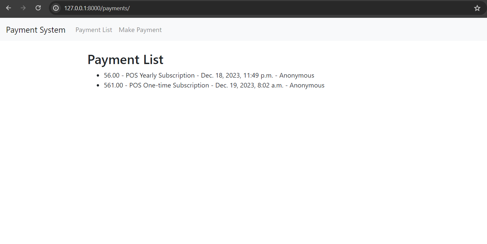

Certainly! Below is a template for your GitHub README.md file. You can customize it according to your project details.

```markdown
# Payment System

This is a simple payment system implemented using Django, MongoDB, and JavaScript.

## Overview

The Payment System allows users to make payments and view a list of previous payments. It is built with Django as the backend framework, MongoDB as the database, and JavaScript for frontend interactions.

## Features

- Make payments by entering the amount and description.
- View a list of previous payments.

## Technologies Used

- Django: A high-level Python web framework.
- MongoDB: A NoSQL database for data storage.
- JavaScript: Used for frontend interactions.
- Djongo: A Django database connector for MongoDB.

## Setup

1. Clone the repository:

   ```bash
   git clone https://github.com/blingyplus/payment_system.git
   cd payment_system
   ```

2. Create a virtual environment (recommended):

   ```bash
   python -m venv venv
   ```

3. Activate the virtual environment:

   - On Windows:

     ```bash
     .\venv\Scripts\activate
     ```

   - On macOS and Linux:

     ```bash
     source venv/bin/activate
     ```

4. Install dependencies:

   ```bash
   pip install -r requirements.txt
   ```

5. Run migrations:

   ```bash
   python manage.py migrate
   ```

6. Run the development server:

   ```bash
   python manage.py runserver
   ```

   Visit `http://127.0.0.1:8000/` in your browser.

## Usage

- Make payments by navigating to the "Make Payment" page.
- View the list of payments on the "Payment List" page.

## Contributing

Contributions are welcome! If you find any issues or have suggestions for improvements, feel free to open an issue or submit a pull request.

## License

This project is licensed under the [MIT License](LICENSE).

```

